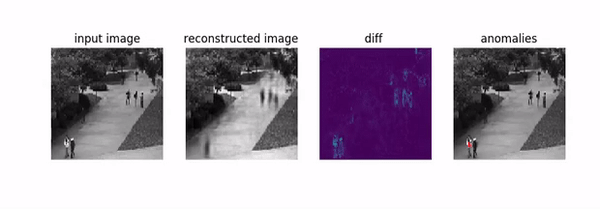
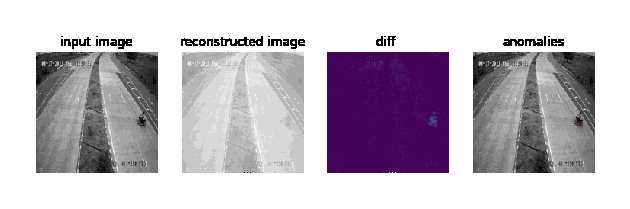

# CVAD-GAN: Constrained video anomaly detection via generative adversarial network - CVAD_gan.ipynb 

This Jupyter notebook (`CVAD_gan.ipynb`) contains the implementation of a CVAD-GAN: Constrained video anomaly detection via generative adversarial network components. The notebook demonstrates the training of the model and provides functionalities for performing inference and visualizing results.

## Overview

The notebook implements a CVAE-GAN model, a hybrid architecture that combines the benefits of both Variational Autoencoders (VAEs) and Generative Adversarial Networks (GANs). This model is designed for image generation and anomaly detection.

Peds1 (#Video No.- 21)

Peds2 (#Video No.- 4)

Avenue (#Video No.- 12)


## Real Life Highway Video

** Note ** We are preparing a new dataset which is not mentioned in the manuscript which is still under Cleaning and adaption process as the purpose of this dataset to take Video Anomaly Detection Problem to Real Time Video Detection And to Hardware Video Anomaly Detection. below is the result:- 



## Dependencies

- Python 3.8
- Jupyter Notebook
- TensorFlow
- Keras
- OpenCV
- Matplotlib
- Pillow

Install the dependencies using the following command:

```bash
pip install -r requirements.txt
```

## Usage
1. Open the Jupyter notebook:
```bash
jupyter notebook CVAD_GAN.ipynb
```
2. Execute the cells in the notebook sequentially.

3. Adjust hyperparameters, paths, or other configurations as needed.

## Training
Execute the cells related to model training to train the CVAD-GAN model. This involves loading the dataset, defining the model architecture, and training for a specified number of epochs.

## Inference
Execute the cells related to model inference to generate images and visualize results. This may involve loading a pre-trained model or using the trained model from the training phase.

## Results
View the generated images and anomaly detection results in the notebook. Optionally, save generated images in the img directory.

## File Structure
```bash
├── CVAD_GAN.ipynb               # Jupyter notebook for CVAD-GAN implementation
├── requirements.txt             # List of dependencies
├── img/                          # Directory to save generated images
├── models/                       # Directory to save trained models (if applicable)
├── dataset/                      # Directory containing the dataset
    ├── train/                    # Training data
    ├── test/                     # Testing data
```
